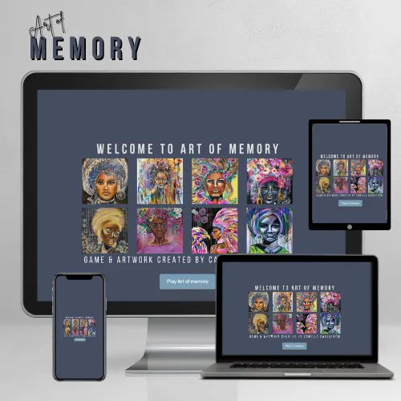
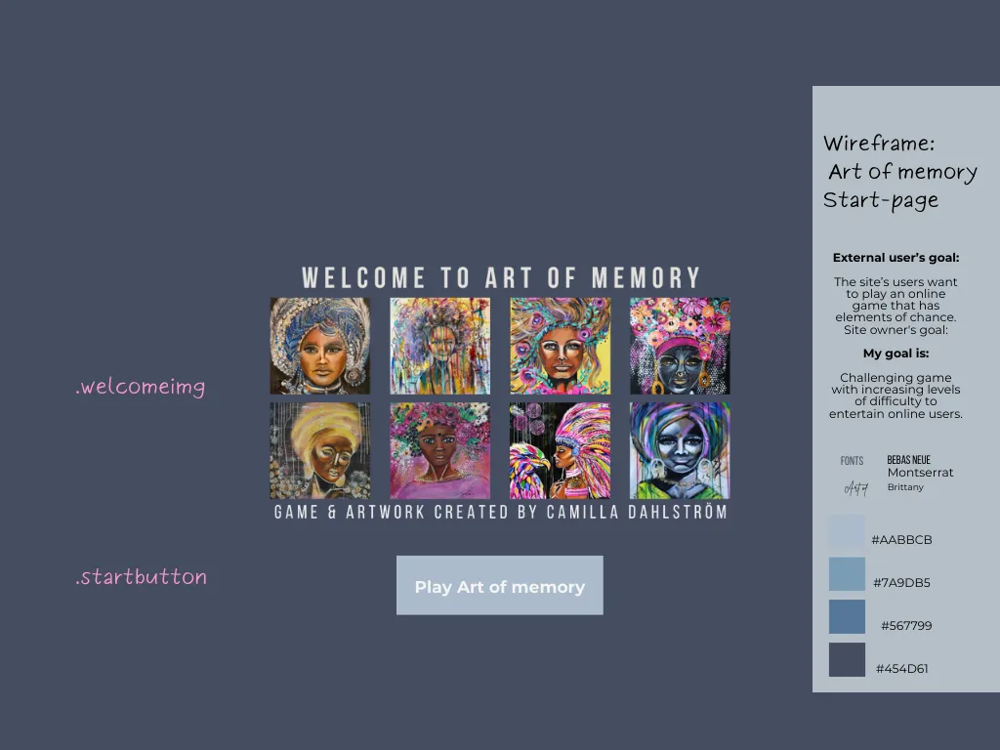
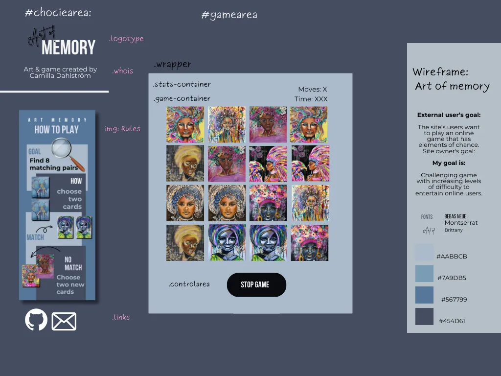
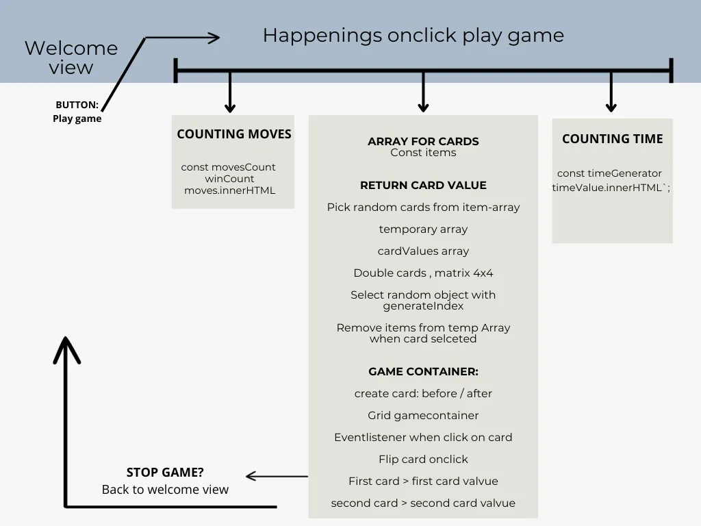
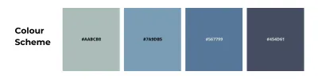
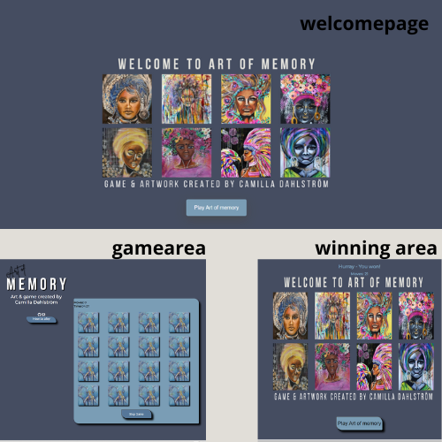

# Art of memory
Art of memory is a classic game for one player. The game contains 8 pairs and start with the front up side down. The user select two cards-  if they match- two new cards can be selected.  The game count moves and time so the  user can compete against himself.
The site is responsive across all screen sizes.

## Table of Contents
+ [UX](#ux "UX")
  + [Site Purpose](#site-purpose "Site Purpose")
  + [Site Goal](#site-goal "Site Goal")
  + [Audience](#audience "Audience")
  + [Communication](#communication "Communication")
  + [Current User Goals](#current-user-goals "Current User Goals")
  + [New User Goals](#new-user-goals "New User Goals")
+ [Design](#design "Design")
  +[Wireframes](#wireframes "wireframes")
  + [Colour Scheme](#colour-scheme "Colour Scheme")
  + [Typography](#typography "Typography")
  + [Imagery](#imagery "Imagery")
+ [Features](#features "Features")
  + [Existing Features](#existing-features "Existing Features")
+ [Testing](#testing "Testing")
  + [Validator Testing](#validator-testing "Validator Testing")
  + [Unfixed Bugs](#unfixed-bugs "Unfixed Bugs")
+ [Technologies Used](#technologies-used "Technologies Used")
  + [Main Languages Used](#main-languages-used "Main Languages Used")
  + [Frameworks, Libraries & Programs Used](#frameworks-libraries-programs-used "Frameworks, Libraries & Programs Used")
+ [Deployment](#deployment "Deployment")
+ [Credits](#credits "Credits")
  + [Content](#content "Content")
  + [Media](#media "Media")

  ## UX

### Site Purpose:
Welcome to Art of memory. This is my second project as a student at Code Institute to "Full Stack Software Development-diploma". The project includes the languages JavaScript, HTML and CSS. 
The art are made by myself and while working with the project I realized that this kind of game is saleable to artists and photographers who want to increase the value on their websites instead of just having a clean webshop. 
Anyway, MY purpose of the this page is to challenge the user´s memory in a playful and colorful way.

The site is responsive across all screen sizes.

### Site Goal:
I have used my skills in JavaScript, CSS and HTML and created a simple and fun game. 
The goal is to engage user so they return to the site. 

### Audience:
The audience can be all ages. My kids, 13 and 15 years old found it fun and challengeing as a contrast to today's fast games with lots of graphics and high tempo. The artwork can be changed to fit to suit specific target groups.

### Communication:
The game has a big button to start the game. If the user want to quit before all cards are matched the gameboard has a stop-buttom then you arrive to the welcomepage. 
### Current User Goals:

### New User Goals:

### Future Goals:

## Design

### Wireframes:

Wireframes are made start to help me with the layout of the welcomescreen and gamearea. 
I also made a overwiew "mindmap" over the javascript functions so I know what step I have to take to get a functional game. That mindmap is also attatched in below. 

Wireframe:welcomepage:

Wirefram:gamepage:

Mindmap over JS-happenings on gamepage:

### Colour Scheme:
Since the artworks are filled with colors, I wanted  a soft and sober style of the page.  
So I chooced four tones of blue: #454D61, #567799, #7A9DB5, #AABCB which match the artworks.

### Typography:
The fonts are picked from Google Fonts library.
1. BEBAS NEUE - Is in the heading and in the logotype. 
2. Montserrat . Is in the written text in in rule-popup
3. Brittany - In the word: ART in the logotype. 
I choosed theese fonts becase they looks nice together. 

### Imagery:
All artworks are created by me and have been photographed in a studio and processed in photshop. 
All images converted to wedp.format in photoshop
The favicon is also made in photoshop- in three different sizes.

## Features

### Existing Features:
The page contains a welcomepage with a start button. When you click on the button you will be directed to the gamearea with 16 cards, a button for rules and a button for stopping the game. 
#### Landing Page:
![Landing Page]
#### Page Title:

The titel of the page is Art of memory that name is also included in the logotype of the page. 
Under the logotype I have wrote: Art & game created by Camilla Dahlström.

#### Instructions Panel:
Simple rules is displayed in a popup-windows:
"Rules
Find 8 matching pairs by choosing two cards on the board.
If they match- choose two new cards.
You win when you find all 8 pairs.
Good luck!"

#### Game Area:

#### Social Links:
Under the logtype I have added icons to github and my emailadress.

### Features Left to Implement

## Testing

### Validator Testing
- html files pass through the [W3C validator](https://validator.w3.org/) with no issues found.

- CSS files pass through the [Jigsaw validator](https://jigsaw.w3.org/css-validator/) with no issues found.

- JS files pass through [JSHint](https://jshint.com/) with no issues found.

- page has an excellent Accessibility rating in Lighthouse

### Unfixed Bugs

## Technologies Used

### Main Languages Used
- HTML5
- CSS
- Javascript

### Frameworks, Libraries & Programs Used
- Google Fonts - Both fonts were chosen via Google Fonts
- Font Awesome - for the social links icons 
- GitPod - Integrated Development Environment (IDE) used to build the site
- GitHub - to store my repository for submission.
- Am I Responsive? - To ensure the project looked good across all devices.
- Adobe photoshop - to create the wedp-files artwork.
- Canva.com - to create Wireframes and logotype
- Chrome DevTools - to inspect the website
- Lighthouse - used to assess the overall quality of the site.
- W3C Markup Validation site - used to find issues in the html for the site and to resolve them
- W3C CSS Validation site - used to find issues in the CSS for the site and to resolve them.
- JS Hint validation site - used to find issues in the JavaScript for the site and to resolve them.
- Am I Responsive? site - Generate screenshots of the site across different devices and screen sizes.

## Deployment
The site is created in Gitpod with a template from CodeInstitute.

The regular commits and pushes were sent from GitPod back to the repo on GitHub.

In the GitHub repository, navigate to the Settings tab
From the source section drop-down menu, select the Main Branch
Once the main branch has been selected, the page will be automatically refreshed with a detailed ribbon display to indicate the successful deployment.
## Credits

### Content

### Media
- All artwork created by me.