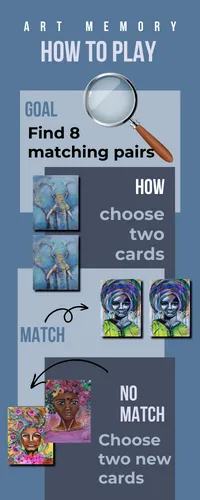

# Art of memory
Art of memory is a classic game for one player. The game contains 8 pairs and start with the front up side down. The user select two cards-  if they match- two new cards can be selected.  The game count moves and time so the  user can compete against himself.

## Table of Contents
+ [UX](#ux "UX")
  + [Site Purpose](#site-purpose "Site Purpose")
  + [Site Goal](#site-goal "Site Goal")
  + [Audience](#audience "Audience")
  + [Communication](#communication "Communication")
  + [Current User Goals](#current-user-goals "Current User Goals")
  + [New User Goals](#new-user-goals "New User Goals")
+ [Design](#design "Design")
  + [Colour Scheme](#colour-scheme "Colour Scheme")
  + [Typography](#typography "Typography")
  + [Imagery](#imagery "Imagery")
+ [Features](#features "Features")
  + [Existing Features](#existing-features "Existing Features")
+ [Testing](#testing "Testing")
  + [Validator Testing](#validator-testing "Validator Testing")
  + [Unfixed Bugs](#unfixed-bugs "Unfixed Bugs")
+ [Technologies Used](#technologies-used "Technologies Used")
  + [Main Languages Used](#main-languages-used "Main Languages Used")
  + [Frameworks, Libraries & Programs Used](#frameworks-libraries-programs-used "Frameworks, Libraries & Programs Used")
+ [Deployment](#deployment "Deployment")
+ [Credits](#credits "Credits")
  + [Content](#content "Content")
  + [Media](#media "Media")

  ## UX

### Site Purpose:
Welcome to Art of memory. This game is made as a student project at Code Institue´s education "Fullstack developer". The project includes the languages JavaScript, HTML and CSS. I hope the user find the game challenging and relaxing. The art are made by myself and while working with the project I realized that this kind of game is saleable to artists and photographers who wish to integrate  
During the process I have realized that this type of game can be useful for artists and photgraphers to increase the value on their websites instead of just having a clean sales. Anyway, MY purpose of the page is to exercise the user's memory in a playful and colorful way.

### Site Goal:
I have used my skills that I have learned when studying JavaScript into a simple and fun game. The goal is to engage both new user and 

### Audience:
The artworks can be changes to 

### Communication:
The game has a big button to start the game. If the user want to quit before all cards are matched the gameboard has a big stop-buttom. You come to the welcomepage. 
### Current User Goals:

### New User Goals:

### Future Goals:

## Design

### Wireframes:

Wireframe over welcomepage:

Wireframe over gamepage:

Mindmap over JS-happenings on gamepage:

### Colour Scheme:
Since the artworks are filled with colors, I wanted  a soft and sober style of the page.  
#454D61
#567799
#7A9DB5
#AABCB 

### Typography:
The fonts are picked from Google Fonts library.
1. BEBAS NEUE - This is the main heading font, and it resembles the universe. It felt fitting to the design.
2. Montserratr the tagline. I wanted it to be easy to read.
3. Brittany - In the word: ART in the logotype.This font is picked from Canva.com
I choosed theese fonts becase the are matching toghether.

### Imagery:
All artworks are created by me and have been photographed in a studio. 
The images are modified and made as wedp.format in photoshop.

## Features

### Existing Features:

#### Landing Page:
![Landing Page]
#### Page Title:
![Page Heading & Tagline]

#### Instructions Panel:

#### Game Area:
![Game screen & toggle switches]

#### Win Screen:
![Win Screen]

#### Lose Screen:
![Lose Screen]

#### Social Links:
![Social Links]

### Features Left to Implement

## Testing

### Validator Testing
- html files pass through the [W3C validator](https://validator.w3.org/) with no issues found.

- CSS files pass through the [Jigsaw validator](https://jigsaw.w3.org/css-validator/) with no issues found.

- JS files pass through [JSHint](https://jshint.com/) with no issues found.

- page has an excellent Accessibility rating in Lighthouse

### Unfixed Bugs

## Technologies Used
### Main Languages Used
- HTML5
- CSS3
- Javascript

### Frameworks, Libraries & Programs Used
- Google Fonts - 
- Font Awesome - 
- GitPod - 
- GitHub - to store my repository for submission.
- Am I Responsive? - to ensure the project looked good across all devices.
- Adobe photoshop - to create the interactive artwork.

## Deployment

## Credits

### Content

### Media
- All artwork created by me.